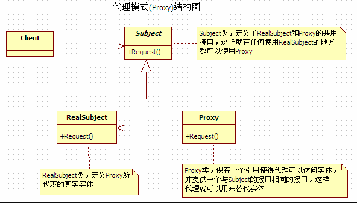

# Java 后端面试

> 这张是自己画的一个Java后端技术栈的思维导图，想去大厂的基本都要会。


##  Java 基础

### 语言基础
1. **[什么是不可变类？Java如何实现不可变类？String为什么是不可变的？](https://www.cnblogs.com/jaylon/p/5721571.html)**
2. **[深拷贝和浅拷贝。如何实现深拷贝？](https://blog.csdn.net/pony_maggie/article/details/52091588)**
3. **[重写了`equals()`方法后需要同时重写`hashcode()`吗？](https://blog.csdn.net/u013679744/article/details/57074669/)**
    https://blog.csdn.net/zzg1229059735/article/details/51498310
4. **[字符串常量池](https://segmentfault.com/a/1190000009888357)**
5. **String、StringBuilder、StringBuffer**
6. **[final、finally和finalize的区别](https://blog.csdn.net/cyl101816/article/details/67640843)**
7. **[简单介绍一下java的反射机制？反射在哪些地方有应用场景？](https://www.sczyh30.com/posts/Java/java-reflection-1/#)**
8. Java8中接口可以添加静态方法和默认实现（default关键字）
9. **[动态代理一般有哪几种实现方式？动态代理的应用场景有哪些？](http://www.cnblogs.com/xiaoluo501395377/p/3383130.html)**
    http://www.importnew.com/26116.html 日志、计时、aop、自定义第三方操作等

### 泛型集合

1. **[HashMap是如何实现的？与HashTable的区别是什么？](https://blog.csdn.net/qq_27093465/article/details/52207135)**
2. List 和 Set 区别
3. List 和 Map 区别
4. Arraylist 与 LinkedList 区别
5. ArrayList 与 Vector 区别
6. HashMap 和 Hashtable 的区别
7. HashSet 和 HashMap 区别
8. HashMap 和TreeMap

### 多线程
1. **[并发特性 - 原子性、有序性、可见性](https://www.cnblogs.com/dolphin0520/p/3920373.html)**

     > 原子性：即一个操作或者多个操作 要么全部执行并且执行的过程不会被任何因素打断，要么就都不执行。 
     > 可见性：指当多个线程访问同一个变量时，一个线程修改了这个变量的值，其他线程能够立即看得到修改的值。 
     > 有序性：即程序执行的顺序按照代码的先后顺序执行，不进行指令重排列。

2. **synchronized实现原理?** 

      > `synchronized` 可以保证方法或者代码块在运行时，同一时刻只有一个进程可以访问，同时它还可以保证共享变量的内存可见性。 
      >
      > Java 中每一个对象都可以作为锁，这是 `synchronized` 实现同步的基础：
      >
      > 1. 普通同步方法，锁是当前实例对象
      > 2. 静态同步方法，锁是当前类的 class 对象
      > 3. 同步方法块，锁是括号里面的对象
      >
      > - **同步代码块**：`monitorenter` 指令插入到同步代码块的开始位置，`monitorexit` 指令插入到同步代码块的结束位置，JVM 需要保证每一个 `monitorenter` 都有一个 `monitorexit` 与之相对应。任何对象都有一个 Monitor 与之相关联，当且一个 Monitor 被持有之后，他将处于锁定状态。线程执行到 `monitorenter`指令时，将会尝试获取对象所对应的 Monitor 所有权，即尝试获取对象的锁。
      > - **同步方法**：`synchronized` 方法则会被翻译成普通的方法调用和返回指令如：`invokevirtual`、`areturn`指令，在 VM 字节码层面并没有任何特别的指令来实现被`synchronized` 修饰的方法，而是在 Class 文件的方法表中将该方法的 `access_flags` 字段中的 `synchronized` 标志位置设置为 1，表示该方法是同步方法，并使用**调用该方法的对象**或**该方法所属的 Class 在 JVM 的内部对象表示 Klass** 作为锁对象。
      > `synchronized` 是重量级锁，在JDK1.6中进行优化，如自旋锁、适应性自旋锁、锁消除、锁粗化、偏向锁、轻量级锁等技术来减少锁操作的开销。 

3. **volatile的实现原理？**
     > volatile是轻量级的锁，**它不会引起线程上下文的切换和调度**。
     >
     > 1. `volatile` 可见性：对一个 `volatile` 的读，总可以看到对这个变量最终的写。
     > 2. `volatile` 原子性：`volatile` 对单个读 / 写具有原子性（32 位 Long、Double），但是复合操作除外，例如 `i++` 。
     > 3. JVM 底层采用“内存屏障”来实现 `volatile` 语义，**防止指令重排序**。
     >
     > `volatile` 经常用于两个两个场景：状态标记变量、Double Check 。 

4. **Java内存模型（JMM）**

      > JMM 规定了线程的工作内存和主内存的交互关系，以及线程之间的可见性和程序的执行顺序。 
      > - 一方面，要为程序员提供足够强的内存可见性保证。
      > - 另一方面，对编译器和处理器的限制要尽可能地放松。JMM 对程序员屏蔽了 CPU 以及 OS 内存的使用问题，能够使程序在不同的 CPU 和 OS 内存上都能够达到预期的效果。
      >
      > Java 采用**内存共享的**模式来实现线程之间的通信。编译器和处理器可以对程序进行重排序优化处理，但是需要遵守一些规则，不能随意重排序。
      >
      > 在并发编程模式中，势必会遇到上面三个概念：
      >
      > - **原子性**：一个操作或者多个操作要么全部执行要么全部不执行。
      > - **可见性**：当多个线程同时访问一个共享变量时，如果其中某个线程更改了该共享变量，其他线程应该可以立刻看到这个改变。
      > - **有序性**：程序的执行要按照代码的先后顺序执行。
      >
      > 通过`volatile`、`synchronized`、`final`、`concurrent`包等 实现。

5. **有关队列AQS队列同步器**

      > AQS是构建锁或者其他同步组件的基础框架（如 ReentrantLock、ReentrantReadWriteLock、Semaphore 等）,包含了实现同步器的细节（获取同步状态、FIFO 同步队列）。AQS 的主要使用方式是**继承**，子类通过继承同步器，并实现它的**抽象方法**来管理同步状态。
      >
      > 1. 维护一个同步状态`state`。当 `state > 0` 时，表示已经获取了锁；当 `state = 0` 时，表示释放了锁。
      > 2. AQS 通过内置的 FIFO 同步队列来完成资源获取线程的**排队工作**：
      >    - 如果当前线程获取同步状态失败（锁）时，AQS 则会将当前线程以及等待状态等信息构造成一个节点（Node）并将其加入同步队列，同时会阻塞当前线程
      >    - 当同步状态**释放**时，则会把节点中的线程唤醒，使其再次尝试获取同步状态。
      >
      > AQS内部维护的是**CLH 双向同步队列**
      >
      >

6. **锁的特性**

      > - 可重入锁：指的是在一个线程中可以多次获取同一把锁。 ReentrantLock 和synchronized 都是**可重入锁。**
      >
      > - 可中断锁：顾名思义，就是可以相应中断的锁。synchronized就不是可中断锁，而Lock是可中断锁。
      >
      > - 公平锁：即尽量以请求锁的顺序来获取锁。synchronized是非公平锁，ReentrantLock和ReentrantReadWriteLock，它默认情况下是非公平锁，但是可以设置为公平锁。

7. **ReentrantLock锁**

      > ReentrantLock，可重入锁，是一种**递归无阻塞的同步机制**。它可以等同于 `synchronized` 的使用，但是 ReentrantLock 提供了比 `synchronized` 更强大、灵活的锁机制，可以减少死锁发生的概率。

8. **ReentrantReadWriteLock**

      >读写锁维护着**一对**锁，一个读锁和一个写锁。通过分离读锁和写锁，使得并发性比一般的排他锁有了较大的提升：
      >
      >- 在同一时间，可以允许**多个**读线程同时访问。
      >- 但是，在写线程访问时，所有读线程和写线程都会被阻塞。
      >
      >读写锁的**主要特性**：
      >
      >1. 公平性：支持公平性和非公平性。
      >2. 重入性：支持重入。读写锁最多支持 65535 个递归写入锁和 65535 个递归读取锁。
      >3. 锁降级：遵循获取**写**锁，再获取**读**锁，最后释放**写**锁的次序，如此写锁能够**降级**成为读锁。

9. **Synchronized和Lock的区别**

      > - Lock是一个接口，而synchronized是Java中的关键字，synchronized是内置的语言实现；
      > - synchronized在发生异常时，会自动释放线程占有的锁，因此不会导致死锁现象发生；而Lock在发生异常时，如果没有主动通过unLock()去释放锁，则很可能造成死锁现象，因此使用Lock时需要在finally块中释放锁；
      > - Lock可以让等待锁的线程响应中断，而synchronized却不行，使用synchronized时，等待的线程会一直等待下去，不能够响应中断；
      > - 通过Lock可以知道有没有成功获取锁，而synchronized却无法办到。
      > - Lock可以提高多个线程进行读操作的效率。
      >
      > 更深的：
      >
      > 1. 与 `synchronized` 相比，ReentrantLock提供了更多，更加全面的功能，具备更强的扩展性。例如：时间锁等候，可中断锁等候，锁投票。
      > 2. ReentrantLock 还提供了条件 Condition ，对线程的等待、唤醒操作更加详细和灵活，所以在多个条件变量和高度竞争锁的地方，ReentrantLock 更加适合（以后会阐述Condition）。
      > 3. ReentrantLock 提供了可轮询的锁请求。它会尝试着去获取锁，如果成功则继续，否则可以等到下次运行时处理，而 `synchronized` 则一旦进入锁请求要么成功要么阻塞，所以相比 `synchronized` 而言，ReentrantLock会不容易产生死锁些。
      > 4. ReentrantLock 支持更加灵活的同步代码块，但是使用 `synchronized` 时，只能在同一个 `synchronized` 块结构中获取和释放。注意，ReentrantLock 的锁释放一定要在 `finally` 中处理，否则可能会产生严重的后果。
      > 5. ReentrantLock 支持中断处理，且性能较 `synchronized` 会好些。

10. Java中线程同步的方式

        > 1. sychronized同步方法或代码块
        > 2. volatile
        > 3. Lock
        > 4. ThreadLocal 
        > 5. 阻塞队列（LinkedBlockingQueue）
        > 6. 使用原子变量（java.util.concurrent.atomic）

11. HashMap是不是线程安全?如何体现？如何变得安全？

12. HashMap 和ConcurrentHashMap 的区别？

13. ConcurrentHashMap 的实现方式？

14. volatile关键字的作用？为什么使用AtomicLong而不使用Long?AtomicLong的底层是怎么实现的？ 

15. 实现线程安全的方式有哪些?并介绍一下实现? 

16. 线程池

17. CAS是一种什么样的同步机制？ 

18. CountDownLatch和CyclicBarrier的区别？ 

19. 线程加锁有哪些方式？synchronized和lock的区别？ 

20. 怎么控制线程，尽可能减少上下文切换？ 

21. 什么是乐观锁和悲观锁？

### I/O 


### JVM


## Java Web

### web基础

### Spring

## 数据库

## 设计模式

**创建型模式：**

- **单例模式**
- 抽象工厂模式
- 建造者模式
- 工厂方法模式
- 原型模式

**结构型模式：**

- 适配器模式
- 桥接模式
- **装饰模式**
- 组合模式
- 外观模式
- 享元模式
- **代理模式**

**行为型模式：**

- 模版方法模式
- 命令模式
- 迭代器模式
- **观察者模式**
- 中介者模式
- 备忘录模式
- 解释器模式
- 状态模式
- 策略模式
- 职责链模式
- 访问者模式。

### 代理模式


**应用：** Spring AOP主要实现方式
可看做是对源程序加壳处理。代理模式可分为静态代理和动态代理。

- 静态代理需要实现原代理的接口，不利于扩展。
-  动态代理不需要实现接口，更通用。动态代理分为 JDK 代理和cglib代理。前者由 JDK 实现，但是需要实现接口，无法代理类。后者是一个单独的 Java 库，既可以代理接口也可以代理类。

### 单例模式
保证类的实例只有一个。
**应用：**例如计数器、Spring默认创建Bean等。需要保证一定的上下文状态，否则可以使用静态类。
懒汉（第一次获取时进行实例化，线程不安全）和饿汉单例（类加载时就实例化，线程安全）。
**线程不安全：**在并发环境下，判断失效，产生多个实例。
**如何改造懒汉单例为线程安全？**

1. 懒汉方式，仅适用一个if进行判断，在多线程中会实例化出多个对象。
2. 最简单的修改方法：直接使用`synchronize`同步整个`getInstance()`。但是这么做，在任何时候只能有已给线程可以调用该方法。
3. DCL + volatile（volatile提供实例的可见性，同时防止指令重排序）
1. **双重检查锁定**
```java

public class Singleton {
    private static volatile Singleton instance = null;
    public static Singleton getInstance() {
        if (instance == null) {
            synchronized (Singleton.class) {
                if (instance == null)
                    //这不是一个原子操作,包含空间分配，构造器初始化和引用赋值
                    instance = new Singleton(); 
            }
        }
        return instance;
    }
}
```
2. **使用静态内部类实现**
```java
/**
 * 类级的内部类，也就是静态的成员式内部类，该内部类的实例与外部类的实例
 * 没有绑定关系，而且只有被调用到时才会装载，从而实现了延迟加载。
 */
public class Singleton {
    private static class SingletonHolder{
        public static Singleton singleton = new Singleton();
    }

    public static Singleton getInstance(){
        return SingletonHolder.singleton;
    }
}
```
3. 枚举实现
```
public enum Singleton {
    /**
     * 定义一个枚举的元素，它就代表了Singleton的一个实例。
     */
    uniqueInstance;
    /**
     * 单例可以有自己的操作
     */
    public void singletonOperation(){
        //功能处理
    }
}
```

###  建造者模式


**思想：**对象和对象创建过程分离解耦。由于抽象的Builder类的存在，使得创建人不需要清楚知道待创建对象的细节，只需要关注创建的过程。通过Director来隔离客户和生产过程。通过Director类就能够完全创建出一个复杂对象。

### 工厂三兄弟
1. **简单工厂**


2. **工厂方法**


3. **抽象工厂**


简单工厂：一个工厂负责创建多个抽象的实例。
工厂方法：每个类的实例都对应一个工厂类来创建相应的对象。
抽象工厂：针对于更多类的产品。一个工厂负责一类产品的创建。

### 原型模式

主要是用于对象的复制。一般直接实现`Cloneable`的`clone()`方法即可。


### 模板方法模式


> **模板方法模式是类的行为模式。准备一个抽象类，将部分逻辑以具体方法以及具体构造函数的形式实现，然后声明一些抽象方法来迫使子类实现剩余的逻辑。不同的子类可以以不同的方式实现这些抽象方法，从而对剩余的逻辑有不同的实现。这就是模板方法模式的用意。**

**抽象模板(Abstract Template)角色有如下责任：**

　　- 定义了一个或多个抽象操作，以便让子类实现。这些抽象操作叫做基本操作，它们是一个顶级逻辑的组成步骤。

　　- 定义并实现了一个模板方法。这个模板方法一般是一个具体方法，它给出了一个顶级逻辑的骨架，而逻辑的组成步骤在相应的抽象操作中，推迟到子类实现。顶级逻辑也有可能调用一些具体方法。

**具体模板(Concrete Template)角色又如下责任：**

  - 实现父类所定义的一个或多个抽象方法，它们是一个顶级逻辑的组成步骤。
  - 每一个抽象模板角色都可以有任意多个具体模板角色与之对应，而每一个具体模板角色都可以给出这些抽象方法（也就是顶级逻辑的组成步骤）的不同实现，从而使得顶级逻辑的实现各不相同。

应用：HttpServlet


## 算法与数据结构

1. 逆序输出的可以使用`Stack<T>`。
2. Java中尽可能不用递归，防止出现栈溢出。必要时可以使用尾递归（但Java中为进行优化）
3. hash表
4. 数组和链表
5. 栈和队列
6. 排序算法 


