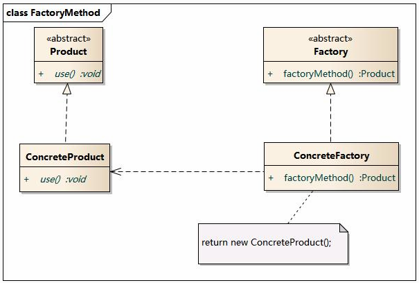
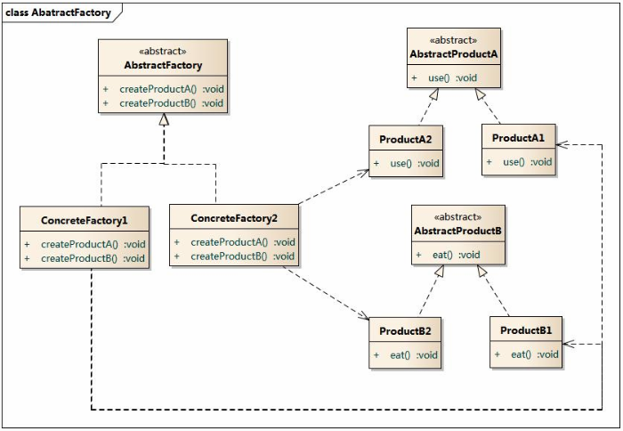
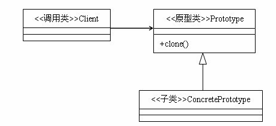
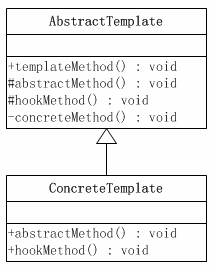

## 设计模式

**创建型模式：**

- **单例模式**
- 抽象工厂模式
- 建造者模式
- 工厂方法模式
- 原型模式

**结构型模式：**

- 适配器模式
- 桥接模式
- **装饰模式**
- 组合模式
- 外观模式
- 享元模式
- **代理模式**

**行为型模式：**

- 模版方法模式
- 命令模式
- 迭代器模式
- **观察者模式**
- 中介者模式
- 备忘录模式
- 解释器模式
- 状态模式
- 策略模式
- 职责链模式
- 访问者模式。

### 代理模式


**应用：** Spring AOP 主要实现方式
可看做是对源程序加壳处理。代理模式可分为静态代理和动态代理。

- 静态代理需要实现原代理的接口，不利于扩展。
-  动态代理不需要实现接口，更通用。动态代理分为 JDK 代理和 cglib 代理。前者由 JDK 实现，但是需要实现接口，无法代理类。后者是一个单独的 Java 库，既可以代理接口也可以代理类。

### 单例模式
保证类的实例只有一个。
**应用：**例如计数器、Spring 默认创建 Bean 等。需要保证一定的上下文状态，否则可以使用静态类。
懒汉（第一次获取时进行实例化，线程不安全）和饿汉单例（类加载时就实例化，线程安全）。
**线程不安全：**在并发环境下，判断失效，产生多个实例。
**如何改造懒汉单例为线程安全？**

1. 懒汉方式，仅适用一个 if 进行判断，在多线程中会实例化出多个对象。
2. 最简单的修改方法：直接使用 `synchronize`同步整个`getInstance()`。但是这么做，在任何时候只能有已给线程可以调用该方法。
3. DCL + volatile（volatile 提供实例的可见性，同时防止指令重排序）
4. **双重检查锁定**
```java

public class Singleton {
    private static volatile Singleton instance = null;
    public static Singleton getInstance() {
        if (instance == null) {
            synchronized (Singleton.class) {
                if (instance == null)
                    //这不是一个原子操作，包含空间分配，构造器初始化和引用赋值
                    instance = new Singleton(); 
            }
        }
        return instance;
    }
}
```
2. **使用静态内部类实现**
```java
/**
 * 类级的内部类，也就是静态的成员式内部类，该内部类的实例与外部类的实例
 * 没有绑定关系，而且只有被调用到时才会装载，从而实现了延迟加载。
 */
public class Singleton {
    private static class SingletonHolder{
        public static Singleton singleton = new Singleton();
    }

    public static Singleton getInstance(){
        return SingletonHolder.singleton;
    }
}
```
3. 枚举实现
```
public enum Singleton {
    /**
     * 定义一个枚举的元素，它就代表了 Singleton 的一个实例。
     */
    uniqueInstance;
    /**
     * 单例可以有自己的操作
     */
    public void singletonOperation(){
        //功能处理
    }
}
```

###  建造者模式


**思想：**对象和对象创建过程分离解耦。由于抽象的 Builder 类的存在，使得创建人不需要清楚知道待创建对象的细节，只需要关注创建的过程。通过 Director 来隔离客户和生产过程。通过 Director 类就能够完全创建出一个复杂对象。

### 工厂三兄弟
1. **简单工厂**


2. **工厂方法**



3. **抽象工厂**



简单工厂：一个工厂负责创建多个抽象的实例。
工厂方法：每个类的实例都对应一个工厂类来创建相应的对象。
抽象工厂：针对于更多类的产品。一个工厂负责一类产品的创建。

### 原型模式


主要是用于对象的复制。一般直接实现 `Cloneable`的`clone()` 方法即可。

### 模板方法模式



> **模板方法模式是类的行为模式。准备一个抽象类，将部分逻辑以具体方法以及具体构造函数的形式实现，然后声明一些抽象方法来迫使子类实现剩余的逻辑。不同的子类可以以不同的方式实现这些抽象方法，从而对剩余的逻辑有不同的实现。这就是模板方法模式的用意。**

**抽象模板 (Abstract Template) 角色有如下责任：**

　　- 定义了一个或多个抽象操作，以便让子类实现。这些抽象操作叫做基本操作，它们是一个顶级逻辑的组成步骤。

　　- 定义并实现了一个模板方法。这个模板方法一般是一个具体方法，它给出了一个顶级逻辑的骨架，而逻辑的组成步骤在相应的抽象操作中，推迟到子类实现。顶级逻辑也有可能调用一些具体方法。

**具体模板 (Concrete Template) 角色又如下责任：**

  - 实现父类所定义的一个或多个抽象方法，它们是一个顶级逻辑的组成步骤。
  - 每一个抽象模板角色都可以有任意多个具体模板角色与之对应，而每一个具体模板角色都可以给出这些抽象方法（也就是顶级逻辑的组成步骤）的不同实现，从而使得顶级逻辑的实现各不相同。

应用：HttpServlet